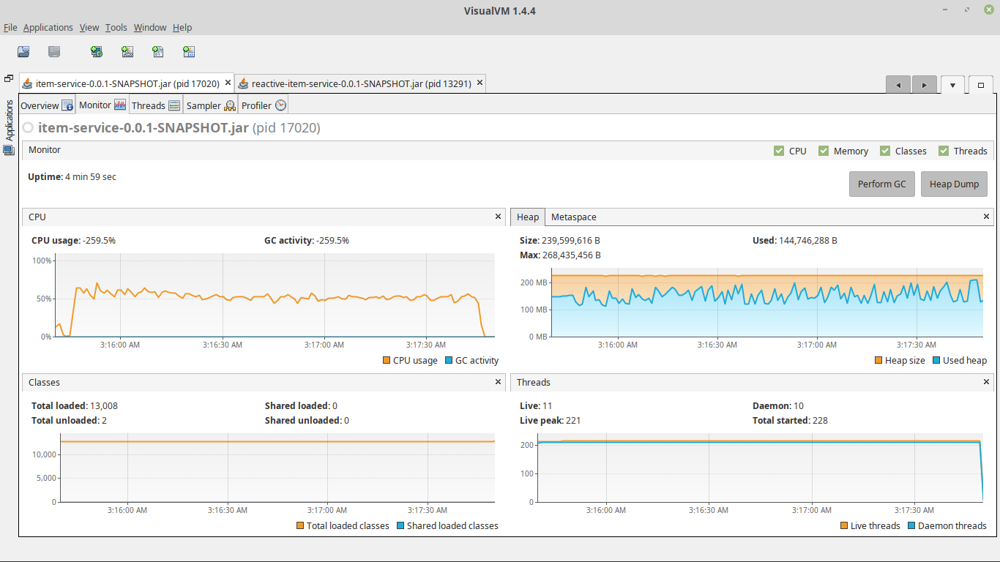
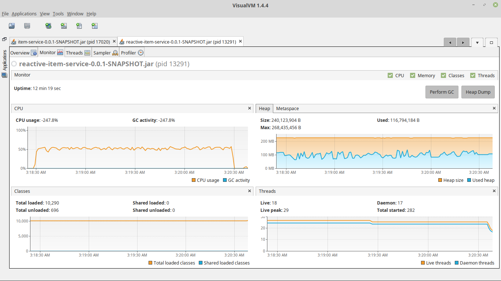

# JDBC vs R2DBC Performance Comparison

## Test context
- Warm up
- Concurrency: 200
- Duration: 2 mins
- Java options:
  - -server
  - -Xmx256m
- Test operation: invoke API resource [POST]<code>/v1/items</code>
- Test method: perform test individually.

## Througput & Latency

## Java Heap Space
### JDBC

### R2DBC
